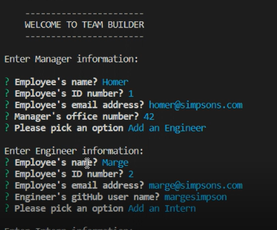
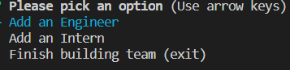
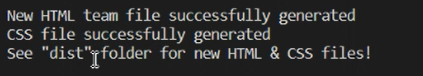
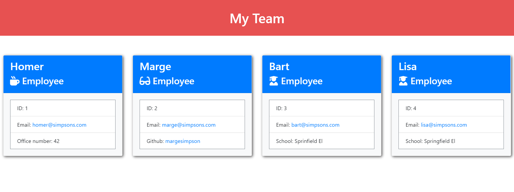

# Team Builder
Week 10 Challenge - Team Profile HTML Generator
  
## Description

This is an application that generates an html page based on user input. The user is prompted to enter information about employees (e.g. name, role, id, email, etc.). This information is used to generate an HTML page which displays all of the employee data in an easy to read format.

## Table of Contents
* [Installation](#installation)
* [Usage](#usage)
* [Tests](#tests)
* [Questions](#questions)

## Installation

In prompt run: "node index"

## Usage

Upon running the application the user is presented with a series of prompts regarding employee information. The user first inputs the information for the Manager, once complete, they then have the option to add either an Engineer, an Intern, or to exit. These options are given after each employee's data has been entered. When the user has entered all the employees, and they choose to exit, they will be presented with a completion message, that indicates the new HTML and CSS files are located in the "dist" folder. If they open the HTML file in their browser, they will be presented with the information they entered, displayed in a clear way.

## Tests

Below are screenshots of the application at various stages when entering test data.

User is presented with a series of prompts to enter employee data, starting with the manager

Once data is entered, the user can choose to enter more employee records or exit

Upon choosing to exit, the below messages will be displayed to indicate successful generation of the HTML and CSS and where they are located

Example of generated HTML page

## Questions

[GitHub](https://github.com/philmcgarty)

[Team-Generator on GitHub](https://github.com/philmcgarty/team-gen)

[Video Demo](https://drive.google.com/file/d/1mXTy7loUgiEYVYU0BdUfvVQysE-THQe6/view)

If you have any questions regarding this project, or require any further information, contact me via gitHub.
